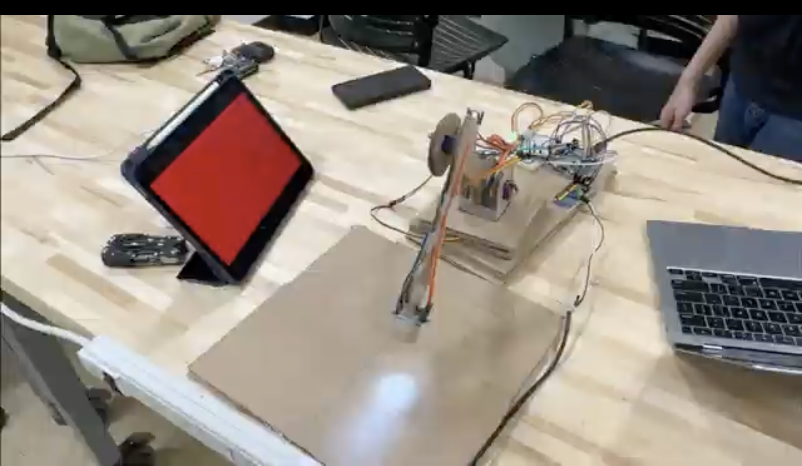

# Robot Arm Color Recognition System

This project implements a color-triggered robot arm positioning system where the arm automatically moves to pre-saved positions when specific colors are detected by a color sensor.

[

## Features

- **Color-Position Memory**: Program the arm to remember specific positions associated with different colors
- **Manual Servo Control**: Position each servo with precision controls
- **Color Detection Mode**: Automatically detect colors and move to saved positions
- **EEPROM Storage**: Save position and color data even when powered off
- **Visual Feedback**: LED indicators show detected colors and system status

## Hardware Requirements

- Arduino (Uno, Mega, etc.)
- PCA9685 Servo Driver Board
- 3 Servo Motors (Base, Shoulder, Elbow)
- TCS3200 Color Sensor
- RGB LED (for status indication)
- Jumper wires and breadboard
- Robot arm chassis/structure

## Wiring Diagram

### Color Sensor Connections:
- S0 → Arduino pin 2
- S1 → Arduino pin 3
- S2 → Arduino pin 4
- S3 → Arduino pin 5
- OUT → Arduino pin 6
- VCC → Arduino 5V
- GND → Arduino GND

### PCA9685 Servo Driver:
- VCC → Arduino 5V
- GND → Arduino GND
- SDA → Arduino A4 (or SDA pin)
- SCL → Arduino A5 (or SCL pin)

### RGB LED:
- Red → Arduino pin 10
- Green → Arduino pin 9
- Blue → Arduino pin 8

## Installation

1. Install the following libraries using the Arduino Library Manager:
   - Adafruit_PWMServoDriver
   - Wire (built-in)
   - EEPROM (built-in)

2. Connect all hardware components according to the wiring diagram

3. Upload the code to your Arduino

## Usage

The system responds to these serial commands:

### Servo Selection and Control
- `B` - Select Base servo
- `S` - Select Shoulder servo
- `E` - Select Elbow servo
- `W` - Increase servo position (large step)
- `Z` - Decrease servo position (large step)
- `A` - Increase servo position (small step)
- `D` - Decrease servo position (small step)
- `0` - Reset all servos to initial positions

### Color Management
- `R` - Select RED slot
- `G` - Select GREEN slot
- `U` - Select BLUE slot
- `4` - Select color slot 4
- `5` - Select color slot 5
- `M` - Save current position and record color for selected slot
- `C` - Only update color data (keep saved position)
- `F` - Toggle color-only mode
- `T` - Toggle color detection on/off
- `I` - Print info about all saved color positions
- `P` - Print current color values and positions

## Calibration Process

1. Position the arm where you want it to go when a specific color is detected
2. Press `R`, `G`, `U`, `4`, or `5` to select a color slot
3. Press `M` to save the current position and calibrate the color sensor
4. Follow the prompts to hold the color in front of the sensor
5. Repeat for other colors
6. Press `T` to enable detection mode

## Demo

When the system detects a color it has been calibrated for, the robot arm will automatically move to the saved position for that color.

## Customization

You can adjust these parameters in the code:

- `servoMins[]` and `servoMaxs[]` - Set servo limits for your specific hardware
- `colorMatchThreshold` - Adjust how closely a color must match to trigger positioning
- `RETURN_DELAY` - Time the arm stays in position before returning to home
- `LARGE_STEP` and `SMALL_STEP` - Adjustment increments for manual control

## Troubleshooting

- **Servos not moving smoothly**: Check power supply capacity, servo driver needs adequate current
- **Colors not detecting reliably**: Adjust lighting conditions and the `colorMatchThreshold` value
- **EEPROM not saving**: Ensure you're not exceeding the Arduino's EEPROM write limit
- **Servo jitter**: Add capacitors across servo power connections to filter noise

## Future Improvements

- Web interface for remote control
- Machine learning for improved color recognition
- Sequence programming for multi-step automation
- Inverse kinematics for coordinate-based positioning

## License

This project is licensed under the MIT License - see the LICENSE file for details.

## Credits

Created by [Your Name] - [Your GitHub Profile]